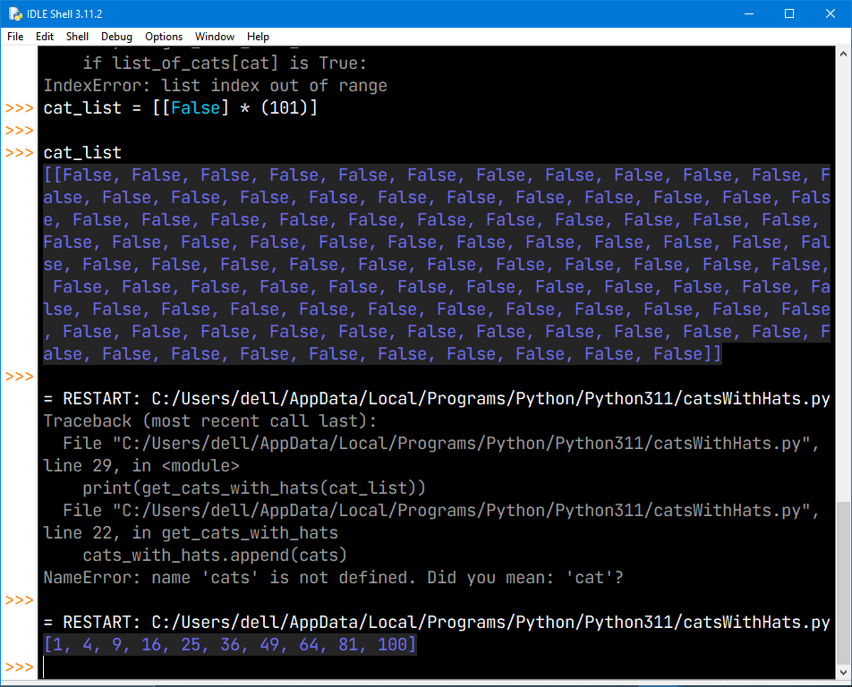

# 9.9 - Challenge: Cats With hats
#Solution

You have 100 cats.
One day, you decide to arrange all your cats in a giant circle. Initially, none of cats have any hats on. You walk around the circle 100 times, always starting at the same spot, with the first cat(cat #1). Every time you stop at a cat, you either put a hat on it if it doesn't have one on, or you take its hat off if it has one one.

1. The first round, you stop at every cat, placing a hat on each one.
2. The second round, you stop every second cat(#2, #4, #6, #8, etc.).
3. The third round, you stop every third cat(#3, #6, #9, #12, etc.).
4. You continue this process until you've made 100 rounds around the cats(e.g., you only visit the 100th cat on the 100th round).

Write a program that simply outputs which cats have hats at the end.

This took me a day to make.
 

